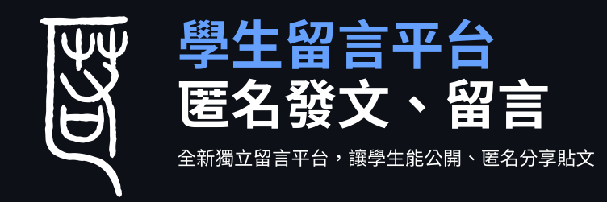

<div align=center>

<picture>
  
</picture>

學生匿名留言平台

</div>

---

Live Demo：https://pths-cowbell.vercel.app/

- 前端：Next.js（App Router）+ Tailwind CSS
- 後端：Supabase (資料庫 & auth)
- 其它：Shadcn (ui 套件), i18next (網站多語言翻譯)

一個用 Next.js + Supabase 打造的留言平台，讓學生能公開、匿名發布貼文和留言。

## 功能

- 公開和匿名發文、留言
- 使用者帳號 (註冊登入, 個人檔案, Google 帳號登入, Google One Tap 一鍵登入)
- 按讚/倒讚 (貼文、留言)
- RWD 和 深色/亮色模式
- 切換網站語言 (中英文翻譯)
- 簡易流量分析整合 (Simple Analytics 平台)

## 快速開始

### 1) git clone 並安裝依賴
   ```bash
   git clone https://github.com/Maxhu787/anon-board.git
   cd anon-board
   ```
   ```bash
   npm install
   ```

### 2) 設置環境變數

   建立 `.env.local` 檔案，並放入 Supabase 和 Google Auth 的 credentials:
   ```
   NEXT_PUBLIC_SUPABASE_URL=your_supabase_url
   NEXT_PUBLIC_SUPABASE_ANON_KEY=your_supabase_anon_key
   NEXT_PUBLIC_GOOGLE_CLIENT_ID=your_google_client_id
   ```

### 3) 啟動開發環境

   ```bash
   npm run dev
   ```

## 目錄

- `/app`：Next.js 前端
- `/lib`：特定功能、auth、i18n 函式
- `/lib/locales`：i18n 翻譯
- `/utils`：Supabase 資料庫
- `/sql`：資料庫各個 table 的設計 schema 檔

## License

CC BY-NC
(https://creativecommons.org/licenses/by-nc/4.0/)

---

For questions or feedback, you can contact me via social links on my website [g4o2.com](https://g4o2.com).<br/>
如有任何疑問或回饋，可以透過我的網站上的社群連結與我聯繫 [g4o2.com](https://g4o2.com)。<br/>
<!--`開發期間 2025/6/18 ~ 2025/9/1`-->
